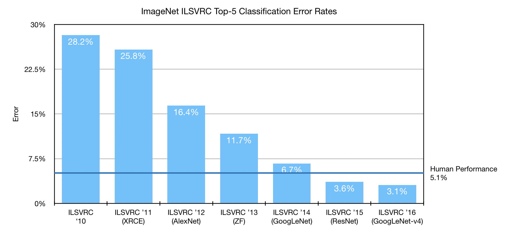
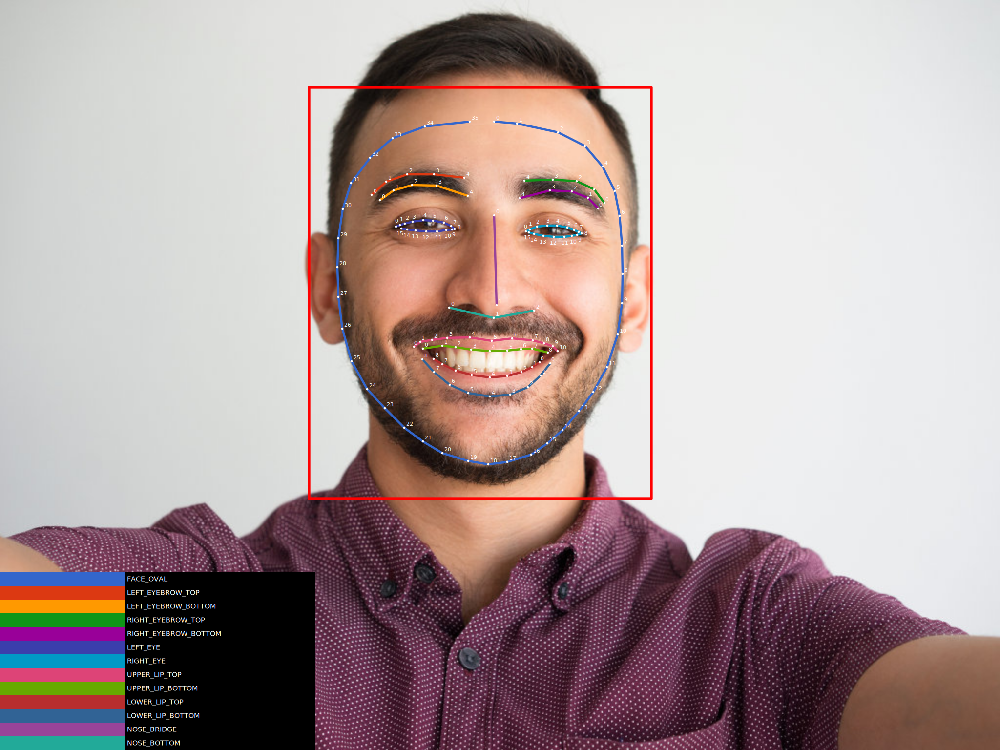
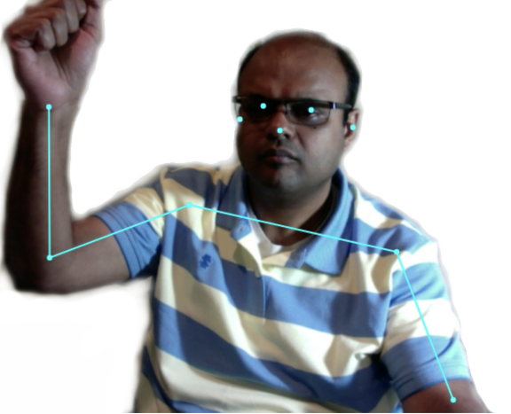
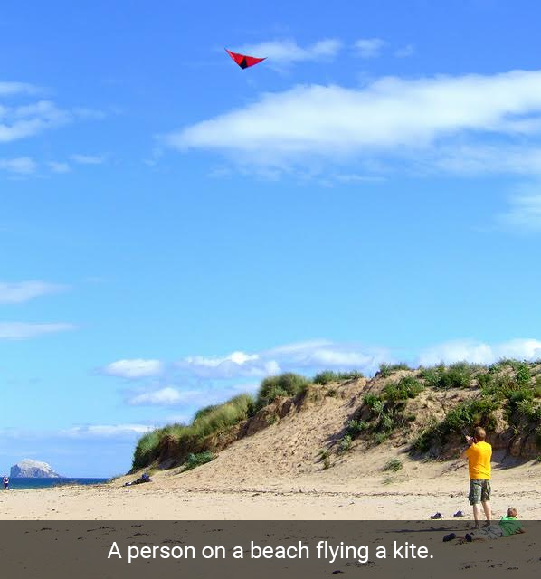

# Chapter 5: Convolutional Neural Networks

Computer vision is a very exciting and challenging field. While research on computer vision has been happening for decades, deep learning has driven the most recent advances providing order of magnitude improvements since 2012. In fact, in 2015, deep learning based models surpassed human accuracy at classification tasks. Convolutional Neural Network or CNN is the main model architecture that has driven these improvements. It is widely used in the industry today. From tagging friends in photos to detecting fractures x-ray, there are lots of applications for computer vision. We will continue the EMNIST example from Chapter 1 and see how CNNs can increase accuracy.  Specifically, this chapter will:

  * Understand key computer vision application areas
  * Explain the architecture of Convolutional Neural Networks and build examples
  * Use regularization techniques to improve generalization of models
  * Detect objects and landmarks in images
  * // Include page numbers for ease of reference

# Technical Requirements
This chapter uses Python, TensorFlow 2.0, Jupyter Notebooks for building and training the models. Data files from training are reused from Chapter 1 Github location. All the code for this chapter is in <Github-Repo>/Chapter5.

For the mobile application pieces, an iOS-based mobile app will be built. It will be developed using XCode running on MacOS 10.13.6 or above. The models developed will be converted for mobile use as demonstrated in previous chapters, using TensorFlow Lite. Further, MLKit, part of Firebase, will be used to put the trained model into the app.
// list technologies and installations required here.

// Provide Github URL for the code in the chapter (setup instructions should be on the Github page). Create a Github folder named, "chX", where X is the chapter number. For example, ch1

# H1: Computer Vision Application Areas
Before building deep learning networks for computer vision tasks, it would useful to get an overview of key problems in this area. Main areas of interest in computer vision, amongst others, are:
* Image classification
* Object detection
* Landmark detection or keypoint detection
* Image labelling and captioning
* Super Resolution

## H2 Image Classification
Interest in application of deep learning in computer vision started with massive gains evidenced in the ImageNet Large Scale Visual Recognition Challenge (ILSVRC). Figure 5-1 below shows the improvements with the arrival of deep learning in 2012 with the landmark AlexNet paper.

Note the huge drop of about 10% between 2011 and 2012 results. This was the advent of deep learning techniques to image recognition. Prior to this, there were very small movements in accuracy. In 2015, CNNs surpassed human level accuracy of 5.1%.

> Info Box: Top-5 Classification Error rate: this measures whether the actual label for a given image was one of the top 5 labels predicted by the model.

In fact, this particular challenge has been retired since 2017 given that human level performance has been surpassed and replaced with object detection described below.

EMNIST is an image classification task. We will build a better image classification model using CNNs in this chapter.

## H2 Object Detection
This is a very important aspect of computer vision, being in focus due to interest and advances in self-driving or autonomous vehicles. Objective here is to identify key objects in an image. I t can be applied to videos as well, by parsing a frame at a time. An example is shown in Fig 5-2 below.

ImageNet mentioned above has moved to this as the key benchmark for reporting progress now. This is a complex task as objects may be partially occluded and of different sizes and orientations. Further, for use in autonomous vehicles, the models used must be very fast. This would allow multiple frames of the video to be processed every second leading to higher reliability and safety of the vehicle.

We will build an object detection network later in this chapter to detect character bounding boxes in an image and hook it up to the EMNIST detection model to recognize them.

## H2: Landmark Detection or Keypoint Detection
A key point or a landmark marks an important part or feature of an image. If the image is of a face, then these can be different facial features like eyebrows, eyes, nose, lips etc. Fig 5-3 shows an example from Google's MLKit.
Later in this chapter, we will try to build an app that takes selfies based on how wide a person is smiling. *TODO: See if it is feasible*

(Image source: https://firebase.google.com/docs/ml-kit/detect-faces, CC 3.0 permissive license)

TODO: https://webrtchacks.com/ml-kit-smile-detection/

In other applications, human poses can also be marked. This is a key development used in motion capture techniques that are used in movies and animations. most notable movie that used this live motion capture technique is Avatar directed by James Cameron. Similar techniques were used by Microsoft Kinect to understand human poses to control video games.

## H2: Image Captioning and labelling
This is a very exciting development in the world of deep learning. It combines two areas, namely computer vision and natural language process (NLP). The task is to generate human readable labels given an image. It can be used to convert images into textual features and answer arbitrary questions about objects in the image. It can be used as an assistive technology for visually impaired persons. Applications are endless. This is a very complex field that is an active area of research.

Source: https://ai.googleblog.com/2016/09/show-and-tell-image-captioning-open.html

Chapter 7 of this book is devoted to this application area and will cover it in detail.

## H2: Super Resolution

## Convolutional Neural Networks for Classification
 -
overview of inspiration from visual cortex. Talk about translation invariance and scaling? (check in literature of the two properties of cnn).

 ### Filters and Convolutions
  - intuition behind filters like detecting lines or edges
  - show simple example of edge detection filter using a 3x3 applied to a sample EMNIST image
  - generalise to show we can learn different types of such filters
  - highlight that the key here is building better hierarchical features
  - explain convolution math to explain how to compute padding/no padding etc

  ### Pooling

  - why pooling? How does it help?
  - how to implement pooling in Keras etc

  ### EMNIST with CNNs

  - code up a simple extension to EMNIST code, introduce the utilities lib
  - show how trainable parameters have increased.
  - Ensure two convolutional layers atleast.
  - Plot confusion matrix and highlight any differences from chapt 1

 ### Visualizing Convolutions

  - Using TensorBoard
  - Migrating training real time plots to TensorBoard
  - visualizing output of each convolutional layer
  - show how weights are shifting in dense layers maybe?
  - Show case training and test errors

Activation atlas: https://distill.pub/2019/activation-atlas/

## Generalization through Regularization
The art of minimizing the difference between training and test error.  what is the difference between optimization and machine learning? Explain the purpose of regularization. Talk about constraining weights through L2 norms for dense networks. But say focus is on two specific methods used in CNN - Drop Out and BatchNorm.

### Drop Out
Intuition behind drop out, forcing units to do more work on learning relationships, not depending on everything being present.
 Add to the code and see the difference.
 Explain how to build code so that drop out is used only in training and not in inference.

### Batch Normalization
talk about that this is technically not a regularization method,but is often considered so. the intuition behind it, normalizing the weights in a time and space efficient manner. speeds up training and gets to better minima.
Add to code and see difference.
Talk about Deployment considerations.

## Mobile Optimization Part I
Show how to save and convert to mobile format. talk about building object detection to read lines of text from camera.

## Object Dection / Landmark using CNN? (check what yolo uses)
Check from this article: https://blog.netcetera.com/face-recognition-using-one-shot-learning-a7cf2b91e96c
see if we can isolate characters from a line of text.

### Detecting characters from a line of text from mobile Camera

### Smile Detection Selfie Taking App

  ## Questions

  1. What are the two key properties of a CNN that make them so effective at computer vision tasks?
  2. You may have noticed that the number of trainable parameters have increased significantly when using a CNN. You may wonder if adding more dense layers which lead to same number of trainable parameters would lead to similar accuracy. This is a good exercise to try. Try two architectures:
       - Deeper: Add more layers rather than units in the layers
       - Wider: Add more units in the layers than adding more layers
       and see what you learn about how these networks perform.     
